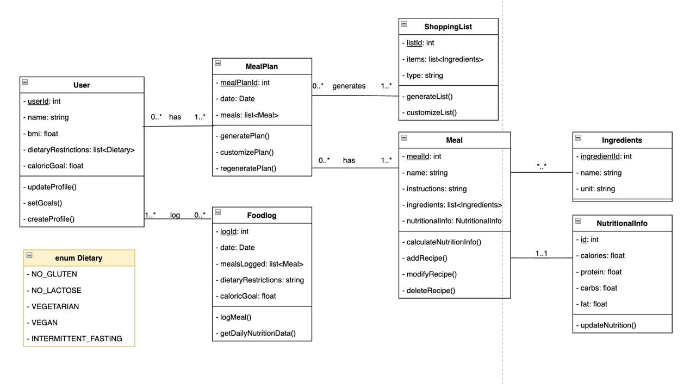

# Specification

**NutriTrack** will empower users to manage their dietary needs effectively through a holistic approach combining meal planning, nutritional tracking, and shopping assistance. The application aims to offer user personalized meal planning and nutrition tracking based on their dietary preferences, nutritional goals, and available ingredients. It facilitates healthy eating by suggesting meals tailored to individual dietary needs.

## Functional Requirements

### User Profile and Preferences 
- Users can create and update their profiles, including information such as dietary restrictions, caloric goals, and preferences (e.g., protein, carbohydrates, fats). 
- Users can set and adjust their dietary goals, including daily caloric intake and target macro-nutrient ratios, to personalize their meal planning and nutrition tracking.

### Meal Planning
- The system generates meal plans based on user profiles and available recipes.
- Users can customize, accept, or regenerate meal plans to fit their preferences.
- `MealPlan` associates specific `Meal` entries with a user.

### Nutrition Tracking
- Users can log their daily food intake by adding meals to `FoodLog`, which tracks each meal they’ve consumed for a particular day.
- The application compares logged meals against user nutritional goals, allowing users to monitor progress in real-time.

### Recipe Management
- The application maintains a database of recipes, represented by `Meal`, with details like ingredients, nutritional information, and preparation instructions.
- Users can add, modify, or delete recipes in the database.
- Each `Meal` includes a list of `Ingredients` and an associated `NutritionalInfo` for detailed nutrition data.

### Shopping List Generation
- The application can automatically generate a `ShoppingList` based on the ingredients required for a meal plan.
- Users can customize the shopping list items before finalizing.

### Optional Social Integration
- Users may have the option to share their meal plans or recipes on social media.
- This feature is optional and not part of the core functionality.

# Final Case Study

- **User Profiles:** Store personal health data and dietary restrictions.
- **Meal Plans:** Users can generate and customize meal plans that automatically create shopping lists for needed ingredients.
- **Meals:** Each meal within a plan details ingredients and nutritional information to ensure users meet their dietary goals.
- **Food Log:** Users log daily meals, helping track nutritional intake over time.
- **Shopping List:** Generated from meal plans to simplify grocery shopping.

## System Relationships
- Users have meal plans and food logs.
- Meal plans contain meals and generate shopping lists.
- Meals include ingredients and calculate nutritional info based on these ingredients.

## Class diagram

